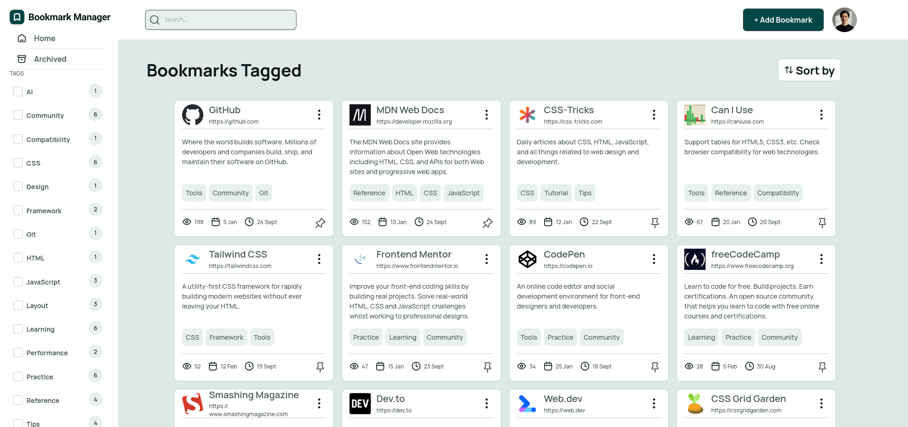

# Frontend Mentor - Bookmark manager app solution

This is a solution to the [Bookmark manager app challenge on Frontend Mentor](https://www.frontendmentor.io/challenges/bookmark-manager-app). Frontend Mentor challenges help you improve your coding skills by building realistic projects. 

## Table of contents

- [Overview](#overview)
  - [The challenge](#the-challenge)
  - [Screenshot](#screenshot)
  - [Links](#links)
- [My process](#my-process)
  - [Built with](#built-with)
  - [What I learned](#what-i-learned)
  - [Continued development](#continued-development)
  - [Useful resources](#useful-resources)
  - [AI Collaboration](#ai-collaboration)
- [Author](#author)
- [Acknowledgments](#acknowledgments)

**Note: Delete this note and update the table of contents based on what sections you keep.**

## Overview

### The challenge

Users should be able to:

- Add new bookmarks with a title, description, website URL, and tags
- View all their bookmarks
- See bookmark details including favicon, title, URL, description, tags, view count, last visited date, and date added
- Search for bookmarks by title in the search bar
- Filter bookmarks by selecting one or multiple tags from the sidebar
- Reset tag filters to view all bookmarks again
- View archived bookmarks
- Archive bookmarks to remove them from the main view without deleting them
- Pin/unpin bookmarks to keep important ones easily accessible
- Edit existing bookmarks to update their details
- Copy bookmark URLs to the clipboard
- Visit bookmarked websites directly from the app
- Sort bookmarks by "Recently added", "Recently visited", or "Most visited"
- Toggle between light and dark color themes
- View the optimal layout for the interface depending on their device's screen size
- See hover and focus states for all interactive elements on the page

### Screenshot

### Current status:

- Authentication is temporarily disabled (auth-off mode).
- The app is directly accessible at `/`.
- Firebase auth integration has been removed from the active app flow.

### Links

- Solution URL: [Add solution URL here](https://your-solution-url.com)
- Live Site URL: [Add live site URL here](https://your-live-site-url.com)

## My process

### Built with

- Semantic HTML5 markup
- CSS custom properties
- Flexbox
- [React](https://reactjs.org/) - JS library
- ExpressJS

### AI Collaboration

I used GitHub Copilot during this project. It helped me debugging, code-completing and solving issues.

## Author

- Frontend Mentor - [@coderalchemy24](https://www.frontendmentor.io/profile/coderalchemy24)

